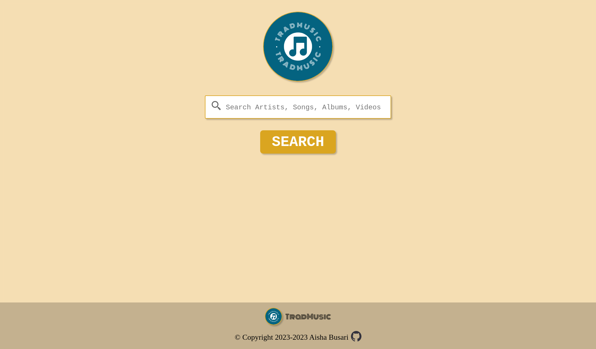

# Trad Music App

<table>
    <tr>
    <td></td>
    </tr>
</table>

### Description

This project is a music app that will play music and videos using the Youtube API, and display information about each artist using the LastFM API. I am building it with ReactJS, Styled Components, Fetch API, and ViteJS. I am using this project to learn ReactJS and Styled Components.
